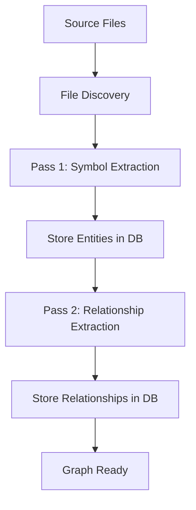
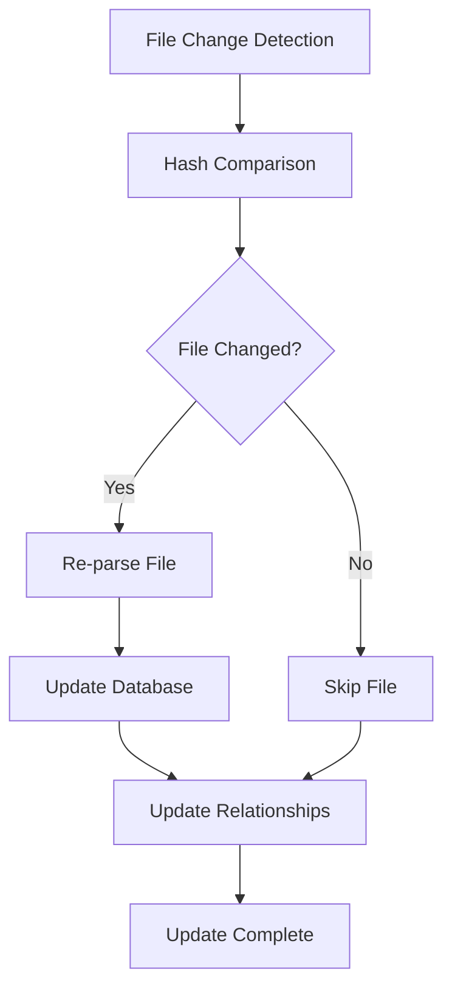
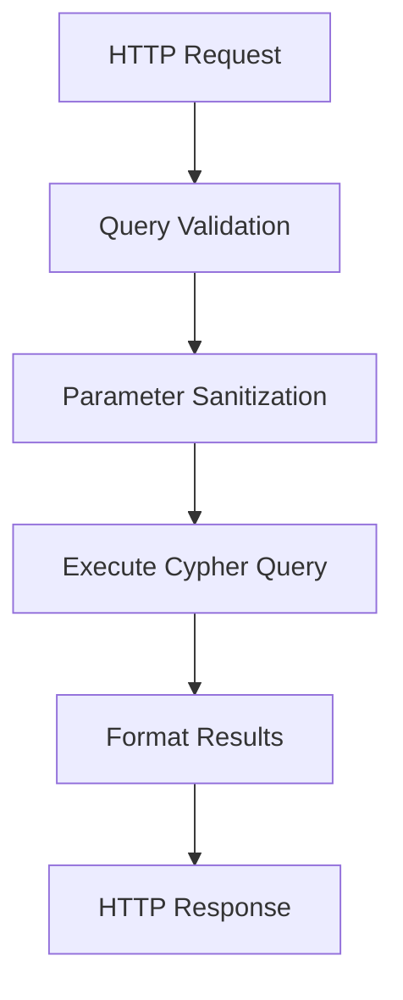
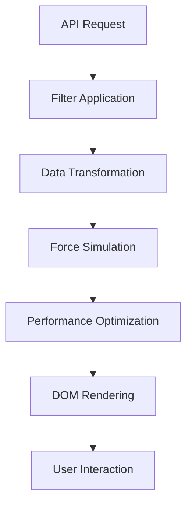

# CodeBased Architecture

This document describes the technical architecture of CodeBased, explaining how the components work together to provide code graph visualization and analysis.

## Overview

CodeBased follows a multi-layered architecture with clear separation of concerns:

```
┌─────────────────────────────────────────────┐
│                Web Frontend                 │
│           (D3.js Visualization)            │
└─────────────────────────────────────────────┘
                       │ HTTP/REST
┌─────────────────────────────────────────────┐
│               FastAPI Server                │
│              (REST Endpoints)               │
└─────────────────────────────────────────────┘
                       │ Python API
┌─────────────────────────────────────────────┐
│              Database Service               │
│               (Kuzu Interface)              │
└─────────────────────────────────────────────┘
                       │ Cypher
┌─────────────────────────────────────────────┐
│                Kuzu Database                │
│             (Graph Storage)                 │
└─────────────────────────────────────────────┘
            ┌──────────────────────┐
            │   Incremental Parser │
            │    (Python AST)      │
            └──────────────────────┘
```

## Core Components

### 1. Database Layer (Kuzu)

**Purpose**: Store and query the code graph
**Technology**: Kuzu embedded graph database
**Location**: `src/codebased/database/`

```python
# Database Service Interface
class DatabaseService:
    def __init__(self, db_path: str)
    def execute_query(self, query: str, params: dict) -> List[Dict]
    def create_schema(self) -> None
    def health_check(self) -> Dict
    def get_stats(self) -> Dict
```

**Schema Design**:
```cypher
# Node Types
CREATE NODE TABLE File(id STRING, path STRING, hash STRING, size INT64, PRIMARY KEY(id));
CREATE NODE TABLE Module(id STRING, name STRING, docstring STRING, PRIMARY KEY(id));
CREATE NODE TABLE Class(id STRING, name STRING, docstring STRING, line_start INT64, line_end INT64, PRIMARY KEY(id));
CREATE NODE TABLE Function(id STRING, name STRING, docstring STRING, line_start INT64, line_end INT64, complexity INT64, PRIMARY KEY(id));
CREATE NODE TABLE Import(id STRING, module STRING, alias STRING, is_from_import BOOLEAN, PRIMARY KEY(id));

# Relationship Types
CREATE REL TABLE CONTAINS(FROM File TO Module, FROM File TO Class, FROM File TO Function, FROM File TO Import);
CREATE REL TABLE DEFINES(FROM Module TO Class, FROM Class TO Function);
CREATE REL TABLE CALLS(FROM Function TO Function);
CREATE REL TABLE IMPORTS(FROM Import TO File);
CREATE REL TABLE INHERITS(FROM Class TO Class);
```

**Optimizations**:
- Indexed node IDs for fast lookups
- Columnar storage for analytical queries
- Transaction support for atomic updates
- Query plan optimization

### 2. Parser Layer

**Purpose**: Extract code entities and relationships from source files
**Technology**: Python AST module
**Location**: `src/codebased/parsers/`

#### Two-Pass Parsing System

**Pass 1: Symbol Extraction**
```python
class SymbolExtractor(ast.NodeVisitor):
    def visit_ClassDef(self, node) -> None
    def visit_FunctionDef(self, node) -> None
    def visit_Import(self, node) -> None
    def visit_ImportFrom(self, node) -> None
```

**Pass 2: Relationship Resolution**
```python
class RelationshipExtractor(ast.NodeVisitor):
    def visit_Call(self, node) -> None  # Function calls
    def visit_Attribute(self, node) -> None  # Method calls
    def visit_Name(self, node) -> None  # Variable references
```

#### Incremental Updates
```python
class IncrementalUpdater:
    def __init__(self, config, db_service)
    def update_graph(self, path: Optional[str] = None) -> Dict
    def _get_file_hash(self, file_path: Path) -> str
    def _is_file_changed(self, file_path: Path, stored_hash: str) -> bool
    def _cleanup_removed_files(self, current_files: Set[str]) -> None
```

**File Change Detection**:
1. Calculate SHA-256 hash of file content
2. Compare with stored hash in database
3. Parse only changed files
4. Update relationships for affected files
5. Clean up deleted file references

### 3. API Layer (FastAPI)

**Purpose**: Provide REST endpoints for frontend and external tools
**Technology**: FastAPI with Pydantic models
**Location**: `src/codebased/api/`

```python
# Core endpoints
@router.get("/graph", response_model=GraphResponse)
@router.post("/query", response_model=QueryResponse)
@router.post("/update", response_model=UpdateResponse)
@router.get("/templates", response_model=TemplatesResponse)
@router.get("/status", response_model=StatusResponse)
```

**Request/Response Models**:
```python
class GraphNode(BaseModel):
    id: str
    name: str
    type: str
    file_path: Optional[str]
    line_start: Optional[int]
    line_end: Optional[int]
    metadata: Dict[str, Any]

class GraphEdge(BaseModel):
    source: str
    target: str
    relationship_type: str
    metadata: Dict[str, Any]

class QueryRequest(BaseModel):
    query: str
    parameters: Dict[str, Any] = {}
```

**Security Measures**:
- Query validation (read-only operations)
- Parameter sanitization
- Timeout protection (30s default)
- CORS configuration
- Error message sanitization

### 4. Frontend (D3.js Visualization)

**Purpose**: Interactive graph visualization and user interface
**Technology**: Vanilla JavaScript + D3.js v7
**Location**: `web/`

#### Main Components

**Application Controller** (`app.js`):
```javascript
class CodeBasedApp {
    constructor()
    init()
    loadGraphData()
    updateGraph()
    applyFilters()
    handleNodeSelected(node)
}
```

**Graph Visualization** (`graph.js`):
```javascript
class GraphVisualizer {
    constructor(container)
    updateData(graphData)
    setupForceSimulation()
    renderNodes()
    renderEdges()
    centerGraph()
    resetZoom()
}
```

**Performance Manager** (`performance.js`):
```javascript
class PerformanceManager {
    constructor(graphVisualizer)
    optimizeForNodeCount(nodeCount)
    enableWebGL()
    implementViewportCulling()
    setupLevelOfDetail()
}
```

#### Rendering Pipeline

1. **Data Loading**: Fetch graph data from API
2. **Force Simulation**: D3.js force-directed layout
3. **Viewport Culling**: Only render visible nodes/edges
4. **Level-of-Detail**: Simplify distant elements
5. **WebGL Fallback**: Hardware acceleration for large graphs

#### Performance Optimizations

- **Lazy Loading**: Load graph incrementally
- **Debounced Updates**: Batch filter operations
- **Memory Management**: Clean up unused DOM elements
- **Efficient Redraws**: Minimize DOM manipulations

### 5. CLI Interface

**Purpose**: Command-line interface for automation and scripting
**Technology**: Click framework
**Location**: `src/codebased/cli/`

```python
@click.group()
def cli():
    """CodeBased command-line interface."""

@cli.command()
def init():
    """Initialize CodeBased in current directory."""

@cli.command()
@click.option('--full', is_flag=True)
def update(full):
    """Update the code graph."""

@cli.command()
@click.option('--host', default='localhost')
@click.option('--port', default=8000)
def serve(host, port):
    """Start the web server."""
```

### 6. Configuration Management

**Purpose**: Centralized configuration with validation
**Technology**: Pydantic dataclasses + YAML
**Location**: `src/codebased/config.py`

```python
@dataclass
class DatabaseConfig:
    path: str = ".codebased/data/graph.kuzu"
    backup_enabled: bool = True

@dataclass
class ParsingConfig:
    include_patterns: List[str] = field(default_factory=lambda: ["**/*.py"])
    exclude_patterns: List[str] = field(default_factory=lambda: ["venv/**"])
    max_file_size_mb: int = 10

@dataclass
class CodeBasedConfig:
    project_root: str
    database: DatabaseConfig = field(default_factory=DatabaseConfig)
    parsing: ParsingConfig = field(default_factory=ParsingConfig)
    api: APIConfig = field(default_factory=APIConfig)
    web: WebConfig = field(default_factory=WebConfig)
```

## Data Flow

### 1. Initial Graph Generation



### 2. Incremental Updates



### 3. Query Execution



### 4. Visualization Rendering



## Performance Characteristics

### Time Complexity

| Operation | Complexity | Notes |
|-----------|------------|-------|
| File Parsing | O(n) | n = lines of code |
| Graph Query | O(log n) | With proper indexing |
| Incremental Update | O(m) | m = changed files |
| Visualization | O(n²) | Force simulation |

### Space Complexity

| Component | Memory Usage | Notes |
|-----------|--------------|-------|
| Database | O(n + e) | n = nodes, e = edges |
| Parser | O(d) | d = max depth |
| Frontend | O(v) | v = visible elements |
| Total | 100MB per 10K LOC | Approximate |

### Scaling Considerations

**Vertical Scaling**:
- More RAM for larger codebases
- Faster CPU for parsing speed
- SSD for database performance

**Optimization Strategies**:
- Chunked processing for large files
- Background parsing with progress updates
- Database partitioning by project modules
- CDN for static assets in production

## Error Handling

### Parser Errors
- Graceful AST parsing failure handling
- File encoding detection and conversion
- Syntax error reporting with line numbers
- Partial graph updates on failures

### Database Errors
- Connection retry with backoff
- Transaction rollback on failures
- Database corruption detection
- Automatic backup and recovery

### API Errors
- Structured error responses
- Request validation with clear messages
- Query timeout handling
- Rate limiting (optional)

### Frontend Errors
- Network failure recovery
- Progressive enhancement
- Graceful degradation for older browsers
- User-friendly error messages

## Security Considerations

### Query Security
- Read-only query enforcement
- Parameter injection prevention
- Query complexity limits
- Timeout protection

### File System Access
- Path traversal prevention
- Permission checking
- Symlink following controls
- Excluded pattern enforcement

### Network Security
- CORS configuration
- No sensitive data exposure
- Local-only binding by default
- HTTPS support for production

## Extension Points

### Adding New Languages
```python
class JavaScriptParser(BaseParser):
    def parse_file(self, file_path: Path) -> ParseResult
    def extract_entities(self, ast_node) -> List[Entity]
    def extract_relationships(self, ast_node) -> List[Relationship]
```

### Custom Visualizations
```javascript
class CustomVisualizer extends GraphVisualizer {
    renderNodes() { /* Custom node rendering */ }
    renderEdges() { /* Custom edge rendering */ }
    setupInteractions() { /* Custom interactions */ }
}
```

### Additional Metrics
```python
class ComplexityAnalyzer:
    def calculate_cyclomatic_complexity(self, func_node) -> int
    def detect_code_smells(self, class_node) -> List[str]
    def analyze_coupling(self, module_node) -> float
```

## Testing Architecture

### Unit Tests
- Parser component testing
- Database service testing
- API endpoint testing
- Individual function testing

### Integration Tests
- End-to-end parsing pipeline
- API + Database integration
- CLI command testing
- Configuration loading

### Performance Tests
- Large codebase parsing
- Query performance benchmarks
- Memory usage profiling
- Concurrent access testing

This architecture provides a solid foundation for code analysis while maintaining flexibility for future enhancements and scaling.